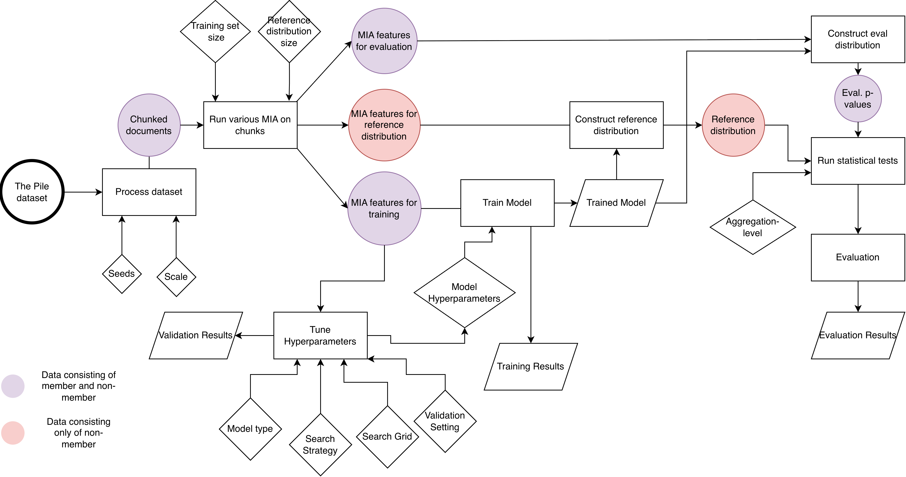

# Enhanced Membership Inference Attacks through Statistical Score Aggregation in Large Language Models


**Author:** Abinash Selvarajah \
**Institution:** Ruhr-University Bochum, Chair for Trustworthy Human Language Technologies \
**Year:** 2026

---

## Abstract
Large Language Model (LLM) are trained on large amounts of human-written text, which is automatically scraped from the internet. Although there exist robots.txt that can prohibit the extraction of information, allegedly most developers ignore these and willingly break copyright laws (European Union, 2019), as shown in the legal case between the New York Times and OpenAI (Audrey Pope, 2024) or between various authors and
Anthropic (Matt O’Brien, 2025). Membership Inference Attack (MIA) were introduced as a method to determine whether a given sample was part of the training set by analyzing the output (Shokri et al., 2017), thereby offering a possible tool to detect copyright violations or private data leakage. The underlying assumption is that the training samples will produce different outputs from the ones not seen during training, because the models weights were optimized using those specific samples. Recent MIA have been shown to be evaluated on ill-designed experiments, in which the training data exhibit a clear distribution shift—such as differences in writing style or time period—relative to the non-training data (Das et al., 2025; Duan et al., 2024; Meeus et al., 2025). Based on the findings of B. Chen et al. (2024), Maini et al. (2024), Meeus et al. (2024), and Puerto et al. (2025), who demonstrate that MIA can still be effective but it heavily depends on the distribution, we instead propose aggregating a dozen different MIAs (Antebi et al., 2025; Carlini et al., 2021; Galli et al., 2024; Shi et al., 2024; Wang et al., 2025; Xie et al., 2025; Zade et al., 2025) to automatically identify the most reliable signals.

Building on the multi-scale aggregation framework of Puerto et al.
(2025), we extend the original ten features to 644 by integrating reference
model-based attacks, including Token-Level InfoRMIA (Tao and Shokri, 2025) and the Window-Based Comparison (Y. Chen et al., 2026), and replace the linear map with Logistic Regression, Multi-Layer Perceptron (MLP), Extreme Gradient Boosting (XGBoost) (T. Chen and Guestrin, 2016), Random Forest (Breiman, 2001) and Support Vector Classifier (SVC). We evaluate the resulting attack on Pythia-2.8B and Pythia-6.9B (Biderman, 2022) over eight subsets of The Pile (Gao et al., 2020a), and model fine-tuned with DuoLearn (Tran et al., 2025) defenses.

The extended attack raises average collection-level AUROC from 0.535 to 0.845 on Pythia-
2.8b and reaches near-perfect separation (-> 0.99) on six of the eight subsets when scaled to Pythia-6.9B. The dominant share of this improvement come from the reference model-based attacks rather than to a larger target-only feature set: the Window-Based Comparison by Y. Chen et al. (2026) alone matches the full reference-only feature set on most subsets with only 48 features. 

Evaluating our attack against models protected by DuoLearn Tran et al. (2025) reduces AUROC at an paragraph level, but as the unlearning weight grows, the reduced weak paragraph signals aggregated over many samples on collection level recovers the signal back to near-perfect AUROC. 

These findings suggest that the membership signal in modern LLM is concentrated in reference-based attacks rather than in target-only features, and that token-level defenses cannot be evaluated only at per-token or per-document granularity if the threat model includes multi-scale aggregation.

## Pipeline overview



## Setup

```bash
cd Masterthesis
python -m venv .venv && source .venv/bin/activate
pip install -r requirements.txt
```

### Download Spacy NER model
```bash
python -m spacy download en_core_web_sm
```

### The script need to have access to various dir locations to save and load datasets/models. If the hf_dir is not in the same folder as this dir, then set a custom path. 
```
export MIA_ROOT=$PWD/mia_scores          
export HF_HOME=$PWD/hf_cache             
export DATASET_DIR=$HF_HOME/datasets/parameterlab
export PCS_DIR=$MIA_ROOT/results/pcs     
export DEFENDED_MODELS_ROOT=$PWD/defended_models
```

## Replication

### 1. Download models + data

```bash
python -m src.utils.download
```
Fetches Pythia-2.8b/6.9b + reference checkpoints (70m/160m/410m/1b) at step1 and final. 
Then download the 8 Pile MIA splits (parameterlab) and chunk them at ctx 43/512/1024/2048.

### 2. Per-paragraph MIA scores

`precompute_mia_scores` shards by document range, so spawn one job per range
to parallelise. `--defended <name>` retargets a defended checkpoint, but needs to have the defended models in pre-defined path.

```bash
python -m src.attacks.precompute_mia_scores \
    --pythia_model pythia-2.8b --dataset arxiv --max_length 1024 \
    --miaset member    --range 0 1000 \
    --member_shot_indices 0,1,2 --nonmember_shot_indices 0,1,2

python -m src.attacks.precompute_mia_scores \
    --pythia_model pythia-2.8b --dataset arxiv --max_length 1024 \
    --miaset nonmember --range 0 1000 \
    --member_shot_indices 0,1,2 --nonmember_shot_indices 0,1,2
```

Merge the shards into one `members.jsonl` / `nonmembers.jsonl` per (key, ctx):

```bash
python -m src.utils.merge_jsonl --kind undefended --key pythia-2.8b --ctx 1024
```

### 3. (Re-)tune aggregator hyperparameters (optional)

The `configs/` folder ships with the tuned values used in the thesis tables.
Re-run only if you change the feature set or evaluate on a new (model, ctx).

```bash
python -m src.attacks.aggregator.motivation_lazypredict \
    --dataset arxiv --ctx 1024 --pythia_model pythia-2.8b
# -> configs/lazypredict_shortlist.json

python -m src.attacks.aggregator.cv_params \
    --dataset arxiv --ctx 1024 --pythia_model pythia-2.8b
# -> configs/cv_params/pythia-2.8b_arxiv_1024.json
```

### 4. Build the precomputed-score (PCS) files

```bash
python -m src.attacks.aggregator.extended_aggregator --dataset arxiv --ctx 1024
python -m src.attacks.aggregator.puerto_baseline     --dataset arxiv --ctx 1024
python -m src.attacks.aggregator.majority_voting_agg \
    --dataset arxiv --ctx 1024 --train 1000
```

PCS files land in `$PCS_DIR/<dataset>/`.

### 5. Aggregate -> AUROC tables

```bash
python -m src.evaluation.run_stats \
    --dataset arxiv --ctx 1024 --pcs_type extended_2.8b \
    --doc_test mwu --coll_test ttest

python -m src.evaluation.run_stats \
    --dataset arxiv --ctx 1024 --pcs_type puerto_2.8b --train 1000
```

`--pcs_type` accepts: `extended_2.8b`, `puerto_2.8b`, `extended_6.9b`,
`puerto_6.9b`, `extended_mimir`, and the per-classifier variants
`{lr,svc,rf,xgb,mlp}_{2.8b,6.9b}`.

### 6. Defended-model variants

Train a defended checkpoint, then re-run steps 2 - 5 with `--defended <name>`:

```bash
python -m src.defended.dpsgd    --dataset arxiv --epsilon 8.0
python -m src.defended.duolearn --dataset arxiv --alpha 0.8 --finetune-ref --gpu 0
```

The suite includes a smoke check on a fixed Bochum text fixture and synthetic
sanity checks for the paragraph -> document -> collection aggregation chain.
